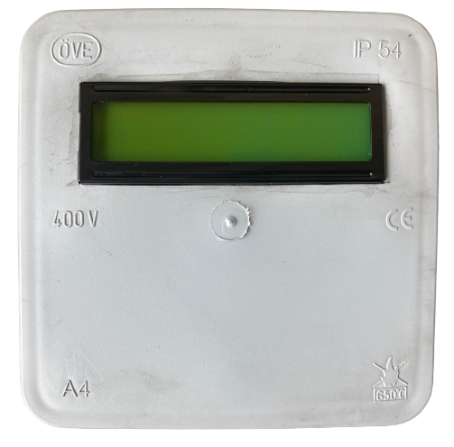

# IoT-Gateway-ESP32-Arduino

ESP32-Arduino based device to send sensors data to cloud with websocket connection.

## Features
  1. WiFi connectivity to sync with server
  2. RS485 port to collect data from client devices
  3. 16x2 LCD display
  4. 3 X high voltage measurement channels with 3.5 mm audio jack connecivity
  5. 3 X current measurement channels with 3.5 mm audio jack connecivity
  6. Temperature and humidity sensor
  7. Li-ion battery backup
