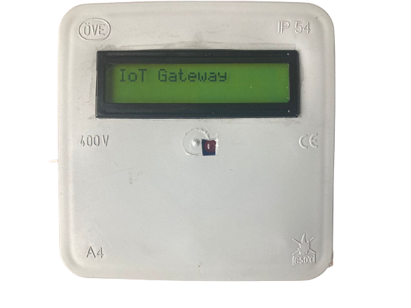
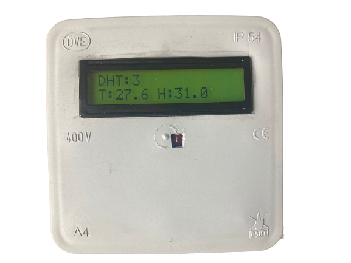
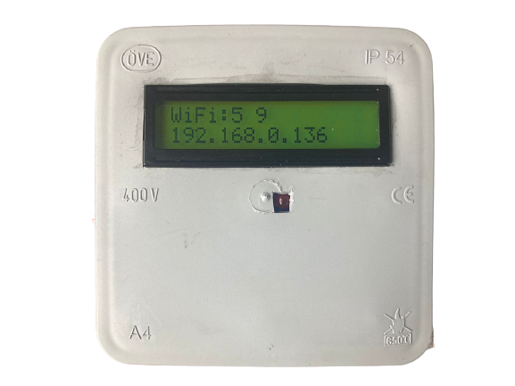

# IoT-Gateway-ESP32-Arduino

ESP32-Arduino based device to send sensors data to cloud with websocket connection.

## Features
  1. WiFi connectivity to sync with server
  2. RS485 port with modbus support to collect data from client devices. Can be configured online to communicate with different devices
  3. 16x2 LCD display
  4. Online configurable 6 measurement channels with 3.5 mm audio jack connectivity. Can be used with AC/DC voltage/current sensors
  5. Temperature and humidity sensor
  6. Li-ion battery backup
  7. Over the air firmware updates
